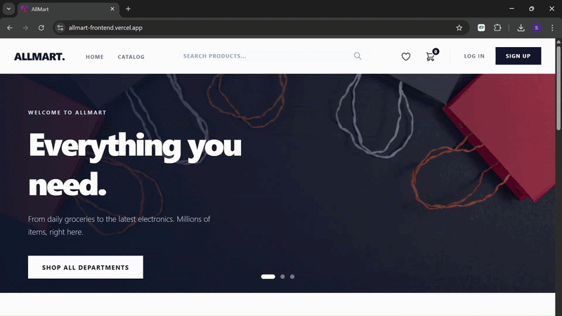
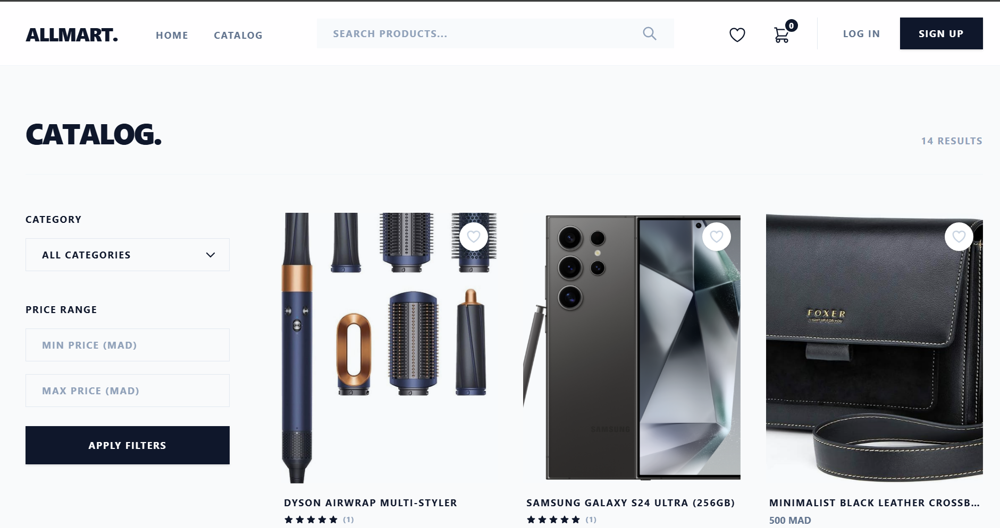
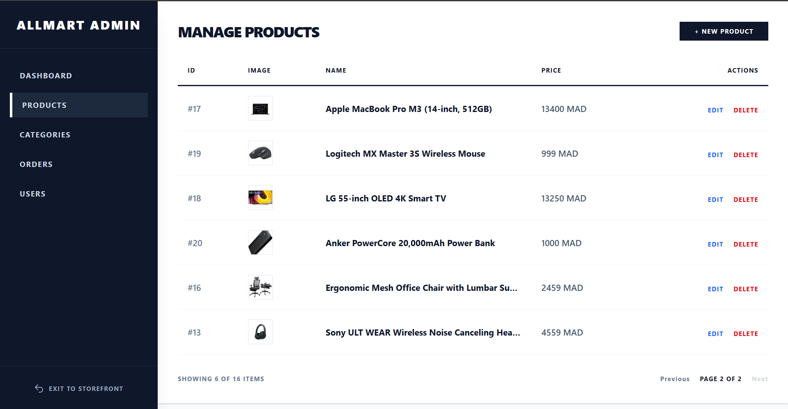
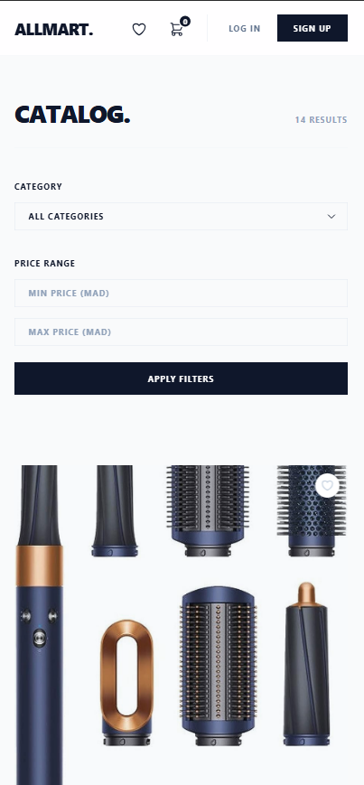

# AllMart Frontend 🛍️

[](https://angular.io)
[](https://www.typescriptlang.org)
[](https://nodejs.org)

A responsive e-commerce storefront and administration dashboard built with Angular. The application supports guest and authenticated checkout workflows, JWT-secured API communication, Stripe payments, and real-time cart state management.

---

## 🔗 Project Links

- 🌐 Live Demo: https://allmart-frontend.vercel.app
- ⚙️ Backend API Repository: https://github.com/sara-basta/allmart-backend
- 📘 Swagger API Docs: https://allmart-backend-b364.onrender.com/swagger-ui/index.html

---

## 🎯 Hero Showcase



---

## ✨ Features

### 🛒 Customer Experience

- Product catalog with filtering and category browsing
- Infinite scrolling for optimized product loading
- Real-time cart state management
- Persistent cart session storage
- Guest checkout workflow
- Authenticated user checkout
- Stripe payment integration
- Wishlist functionality
- Order tracking and purchase history
- Fully responsive UI for mobile, tablet, and desktop

---

### 🔐 Security & Administration

- JWT Authentication with Angular `HttpInterceptor`
- Route Guards for protected admin routes
- Admin dashboard for catalog and order management
- Product image uploads with Cloudinary
- Role-based access control
- Secure API communication with Bearer tokens

---

## 🧰 Tech Stack

| Category | Technologies |
|---|---|
| Frontend Framework | Angular |
| Language | TypeScript |
| Styling | Tailwind CSS / Responsive Design |
| Authentication | JWT |
| Payments | Stripe |
| Media Storage | Cloudinary |
| State Management | RxJS Services |
| Build Tool | Angular CLI |

---

## 📸 UI Gallery

<details>
<summary><strong>🖼️ Click to expand screenshot gallery</strong></summary>

### 🛒 Cart & State Management


---

### 🏬 Main Product Catalog



---

### ⚙️ Admin Dashboard - Products



---

### 📱 Mobile Responsive View



</details>

---

## 🏗️ Frontend Architecture

### Key Design Decisions

- **Feature-Based Modular Structure**  
  Organized into reusable feature modules for maintainability and scalability.

- **Reactive State Management**  
  Uses RxJS-powered services to synchronize cart and authentication state across components.

- **Interceptor-Based Security**  
  JWT tokens are automatically attached to outgoing requests using Angular `HttpInterceptor`.

- **Role-Based Routing**  
  Route guards prevent unauthorized access to protected admin sections.

- **Responsive UI Design**  
  Optimized layouts for desktop, tablet, and mobile devices.

---

## 📋 Prerequisites

Ensure the following tools are installed:

- Node.js 18+
- Angular CLI 21+

### Verify Installations

```bash
node --version
ng version
```

---

## 🚀 Installation

### 1. Clone the Repository

```bash
git clone https://github.com/sara-basta/allmart-frontend.git
cd allmart-frontend
```

---

### 2. Install Dependencies

```bash
npm install
```

---

## ⚙️ Environment Configuration

Edit:

```text
src/environments/environment.ts
```

Configure the API URL and Stripe public key:

```typescript
export const environment = {
  production: false,
  apiUrl: 'http://localhost:8080/api',
  stripePublicKey: 'pk_test_YOUR_STRIPE_PUBLIC_KEY_HERE'
};
```

---

## 🔨 Running the Development Server

Start the Angular development server:

```bash
ng serve
```

Navigate to:

```text
http://localhost:4200/
```

The application automatically reloads whenever source files change.

---

## ☁️ Deployment

| Service | Platform |
|---|---|
| Frontend Hosting | Vercel |
| Backend API | Render |
| Database | Neon PostgreSQL |
| Image Hosting | Cloudinary |

---

## 📦 Project Structure

```plaintext
src/
├── app/
│   ├── core/
│   │   ├── guards/          # Route protection
│   │   ├── interceptors/    # JWT authentication interceptor
│   │   ├── models/          # TypeScript interfaces
│   │   └── services/        # API and state logic
│   │
│   ├── features/            # Catalog, Checkout, Admin modules
│   ├── shared/              # Shared reusable UI components
│   └── environments/        # Environment configurations
│
├── index.html
└── styles.css               # Global styles
```

---

## 🔐 Security Highlights

- JWT authentication via HttpInterceptor
- Route Guards for role protection
- Secure Stripe Elements integration
- Separation between guest and authenticated workflows
- Protected admin dashboard operations

---

## 📘 Backend Integration

The frontend communicates with the Spring Boot backend API through RESTful endpoints.

### Main Integrations

- Authentication & Authorization
- Product Catalog Management
- Order Processing
- Stripe Payment Sessions
- Wishlist Persistence
- Cloudinary Image Uploads

---

## 🧪 Testing

### Run Unit Tests

```bash
ng test
```

---

### Build for Production

```bash
ng build
```

---

## 🛠️ Available Commands

| Command | Description |
|---|---|
| `npm install` | Install dependencies |
| `ng serve` | Start development server |
| `ng build` | Create production build |
| `ng test` | Run unit tests |
| `ng e2e` | Run end-to-end tests |
